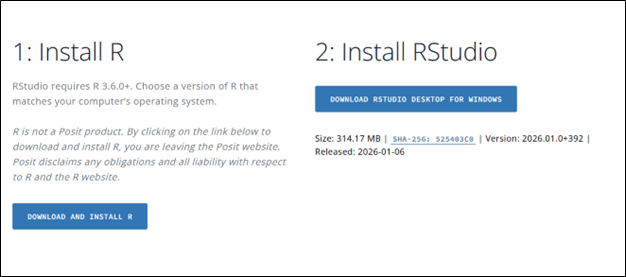
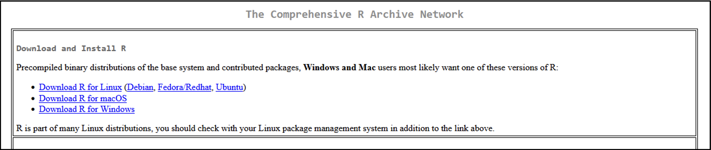
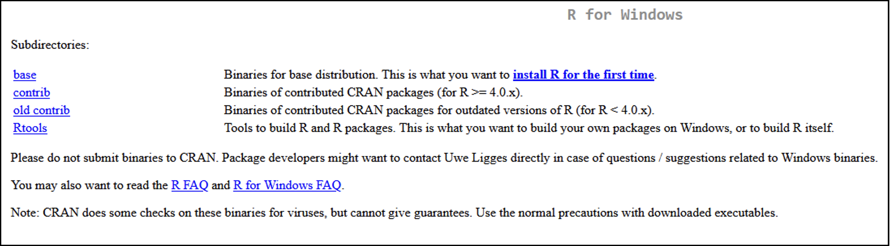
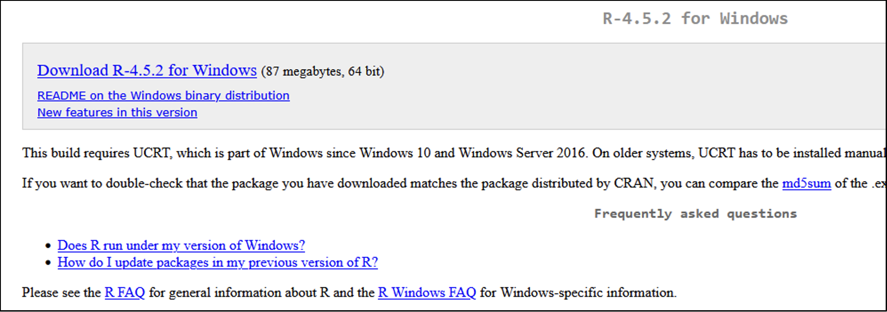

```{r setup, include=FALSE}
knitr::opts_chunk$set(
  echo = TRUE,
  eval = FALSE,   # Set to TRUE when running interactively
  comment = "#>",
  warning = FALSE,
  message = FALSE
)
```

# How to Use This Document

This document is an **R Markdown file** (`.Rmd`). It combines written instructions, example R code, and output in a single file. You can read it as a reference, run the code interactively, or knit the whole thing into a formatted HTML or PDF report.

## What You Need

Before opening this file, make sure you have both R and RStudio installed (see [Installing R and RStudio]). You will also need the `rmarkdown` package:

```{r install-rmarkdown, eval=FALSE}
install.packages("rmarkdown")
```

## Opening This File

Open this `.Rmd` file directly in RStudio via **File > Open File**. You should see the document in the Source pane (top left). If you see a plain text file instead of the formatted document, make sure the file has the `.Rmd` extension and that RStudio is up to date.

## Running Code

Code in this document lives inside **code chunks**, or grey blocks that look like this:

```{r example-chunk, eval=FALSE}
# This is a code chunk
mean(c(1, 2, 3, 4, 5))
```

You have a few options for running code:

| Method | How |
|--------|-----|
| Run a single line | Click on the line and press `Ctrl` + `Enter` (PC) or `Cmd` + `Enter` (Mac) |
| Run an entire chunk | Click the green **play button** (▶) in the top right corner of the chunk |
| Run all chunks above | Click the down arrow (▾) next to the play button |
| Run all chunks | **Code > Run All** in the menu, or `Ctrl` + `Alt` + `R` |

Output appears directly below the chunk in the editor, and also in the Console pane.

> **Note:** Code chunks in this document have `eval = FALSE` set by default, meaning they won't run automatically when knitting. This is intentional, many examples use placeholder file paths (like `"data/my_file.csv"`) that you will need to update before running. Change `eval = FALSE` to `eval = TRUE` in any chunk once you are ready to run it with your own data.

## Knitting the Document

"Knitting" renders this `.Rmd` file into a formatted document. Click the **Knit** button at the top of the editor to render to HTML (default), or click the dropdown arrow next to Knit to choose PDF or Word.

> **Tip:** If knitting fails, check the **R Markdown tab** at the bottom of RStudio. It will show you which line caused the error. The most common issues are a missing package, a file path that doesn't exist, or a chunk with `eval = TRUE` that contains an error.

## Document Structure

This SOP is organized as follows:

| Section | Contents |
|---------|----------|
| **Data Formatting and Organization** | Best practices for structuring your files and spreadsheets before importing into R |
| **Installing R and RStudio** | Step-by-step installation instructions |
| **Getting Started with RStudio** | Projects, the RStudio interface, and installing packages |
| **R Basics** | Core R concepts: objects, vectors, data frames, and more |
| **R Markdown** | How to write and knit R Markdown documents |
| **Examples 1–5** | Worked examples for statistics, LOQ, air concentration, plots, and reports |

---

# Data Formatting and Organization

This section is a brief overview of best practices for organizing your data before starting analyses. The content here is adapted from previous ISRP DMAC presentations.

Credit: Marina Zhang, Brian Westra

## File Naming Best Practices

1. Be descriptive but brief, and stay consistent
2. Use underscores or dashes instead of spaces; avoid special characters
3. Format dates as **YYYY-MM-DD** or **YYYYMMDD** for proper chronological sorting
4. Use version numbers to track changes (e.g., `_01_0` for original, `_01_1` for minor revision, `_02_0` for major revision)
5. File names can include: project acronym, content description, date, creator initials, version, and status (draft/final)


## Organizing Folders 

1. Evaluate your files — plan the folder hierarchy before starting a project, and build the structure around how files will naturally be accessed.
2. Identify folder attributes — categorize by time period, project stage, file type, experiment, instrument, location, or team member. The most important attribute goes at the top level of the hierarchy.
3. Establish a folder hierarchy — nest folders logically, give each project its own folder, avoid overlapping categories, and don't make the structure too deep. Include a README file at the top level and provide a folder template for easy adoption.
4. Organize files systematically — apply your file naming convention and decide whether files should sort chronologically or alphabetically based on which metadata element comes first in the name.

## Best Practices for Tabular Data Structures

1. **Be consistent**: use uniform codes for categories, missing values, variable names, date formats, and data structure across files.
2. **Choose good variable names**: descriptive but without spaces or special characters (e.g., `Max_temp_C` or `MaxTemp`, not `Maximum Temp (°C)`).
3. **Handle missing values properly**: blank cells are the best option; avoid using 0, -999, "None", "No data", or similar strings that can confuse software.
4. **Avoid decorative formatting**: no bold, color, or highlighting to convey meaning. Instead, add a dedicated column (e.g., an "outlier" TRUE/FALSE column).
5. **No comments in cells**: use a separate comments column instead.
6. **Keep values out of column headers**: e.g. income brackets like `<$10k`, `$10-20k` should be values in a column, not headers.
7. **Don't combine multiple variables in one header**: e.g., headers encoding both sex and age (like `m014`) should be split into separate `sex` and `age` columns.
8. **Don't mix rows and columns for variables**: each variable should occupy exactly one column.
9. **Use multiple tables**: when a dataset contains fundamentally different types of observations (e.g., separate song and rank tables), separate out related data into different tables.
10. **One piece of information per cell**: no calculations or graphs in raw data, perform quality checks during entry, back up regularly, and document everything in a data dictionary.


---

# Installing R and RStudio

R and RStudio are sometimes used interchangeably, but they are actually different.
**R** is an open-source programming language designed for statistical computing, data analysis, and data visualization.
**RStudio** is an integrated development environment (IDE) for R, or software that streamlines user experience by providing tools such as a user interface, code editor, and debugger.

## Installing R

1. Follow this link to install R and RStudio: <https://posit.co/download/rstudio-desktop/>
2. Scroll down until you see two steps: **1. Install R** and **2. Install RStudio**

 

3. Click on the button **"Download and Install R"**
4. Follow the instructions on the page. Click the download link that is correct for your operating system.

 

5. You will be sent to another page. Click on the link **"install R for the first time"**.

 

6. In the new page, click the download link at the top of the page. The download will begin after clicking this link.

 

7. Run the downloaded `.exe` file from the file explorer. Follow the prompts to install R.

## Installing RStudio

1. Go back to the first link: <https://posit.co/download/rstudio-desktop/>
2. Scroll down and click on **"Download RStudio Desktop"**. This will start the download.
3. Run the downloaded `.exe` file and follow the prompts to install RStudio.

---

# Getting Started with RStudio

> *This section was adapted from [Data Carpentry's R for Social Scientists](https://datacarpentry.github.io/r-socialsci/00-intro.html#a-tour-of-rstudio) course.*

## Starting a New Project in RStudio

Creating and using Projects keeps your data, analyses, scripts, and related files in a single folder, also called a **working directory**. Keeping all files associated with a project in one location makes it easier to stay organized and share analyses with others.

1. Under the **"File"** menu in the toolbar, click on **"New Project"**, choose **"New Directory"**, then **"New Project"**.
2. Enter a name for the new folder under **"Directory name"** and click **"Browse"** to choose a save location.
3. Click on **"Create Project"**.
4. To start writing scripts, go to **File > New File > R Script**.

## RStudio Interface

RStudio is divided into **four panes**:

| Pane | Location | Contents |
|------|----------|----------|
| **Source** | Top Left | Your scripts and documents |
| **Console** | Bottom Left | Run commands and see output |
| **Environment / History** | Top Right | Objects, functions, data frames, previous commands |
| **Files / Plots / Packages** | Bottom Right | Working directory, plots, installed packages |

## Installing Packages and Calling Libraries

Packages and libraries are generally synonymous. A **package** (or **library**) is a set of code, functions, or data bundled together for specific tasks. Packages make analysis more efficient by allowing users to use code others have already developed.

A comprehensive list of available R packages is available at:
<https://cran.r-project.org/web/packages/available_packages_by_name.html>

### Commonly Used Libraries

| Package | Purpose |
|---------|---------|
| `ggplot2` | Customizing plots and figures |
| `dplyr` | Data manipulation: subsetting, summarizing, joining |
| `tidyr` | Editing the layout of datasets |
| `car` | Data modeling |
| `sp` | Loading and using spatial data |

### Installing Packages

There are two main ways to install packages:

**Option 1 — Using the Packages Panel in RStudio:**

1. Select the **Packages** tab in the lower right pane.
2. Scroll through the list and click the checkbox next to the package you'd like to install. Installation begins automatically.

> **Note:** More specialized libraries may not appear in this list and will need to be installed using code (Option 2).

**Option 2 — Using R Code:**

```{r install-packages}
# Install a package from CRAN
install.packages("package_name")
```

### Calling (Loading) Libraries

Before using a package's functions in your script, you must load it with `library()`. This "activates" the library for your current session.

```{r load-libraries}
# Load a library at the top of your script
library("package_name")
```

> **Best practice:** Add `library()` calls at the top of every script so you and collaborators know which packages are required to run the code.

---

# R Basics

> *This section is adapted from [Data Carpentry's Introduction to R](https://datacarpentry.github.io/r-socialsci/01-intro-to-r.html). Visit the site for more tutorials.*

## Objective: Key R Terminology

Before diving in, make sure you can define the following terms:

- **Variable** — a named storage location for a value
- **Object** — anything stored in R's memory (values, data frames, functions, etc.)
- **Vector** — an ordered collection of values of the same data type
- **Matrix** — a two-dimensional array of values all sharing the same data type, organized into rows and columns
- **Data frame** — a table-like structure where columns are vectors of equal length
- **List** — a flexible collection that can hold elements of different data types, including vectors, matrices, data frames, or other lists
- **Script** — a saved file containing R code
- **Console** — the interactive command-line pane in RStudio
- **Project** — an RStudio workspace that organizes files for a single analysis
- **Working directory** — the folder R uses as the default location to read/write files
- **Packages** — collections of functions and data bundled for a specific purpose

---

**The 6 atomic vector types in R:**

| Type | Description | Example |
|------|-------------|---------|
| `character` | Text strings | `"hello"` |
| `numeric` / `double` | Decimal numbers | `3.14` |
| `logical` | Boolean values | `TRUE`, `FALSE` |
| `integer` | Whole numbers | `2L` |
| `complex` | Complex numbers | `1 + 4i` |
| `raw` | Raw bitstreams | (rarely used) |

## Basic Operations

### Assigning Values to Names

In R, both operators below can be used for assignment:

| Operator | Notes |
|----------|-------|
| `<-` | **Preferred** — makes direction of assignment explicit |
| `=` | Valid but less common for assignment |

These operators assign the value on the **right** to the name on the **left**.

```{r assignment}
Var <- 3 + 5   # Var = 8
Var            # Running the variable name will print the value 
```

> **Naming conventions:**
> - Object names should be explicit and not too long.
> - Names cannot start with a number (`2x` is invalid; `x2` is valid).
> - R is **case sensitive** — `age` and `Age` are different objects.

**Keyboard shortcut for `<-`:**

- **PC:** `Alt` + `-`
- **Mac:** `Option` + `-`

---

### Printing Values

In R, "printing" will show the variable, matrix, or plot on screen. R does not automatically show the value(s) when it is assigned to a variable or object. You can print using "print()":

```{r printing}
area <- 2         # Value assigned to variable

(area <- 2)       # Wrapping in parentheses prints immediately

area              # Typing the object name prints its value

print(area)       # Using the print() function
```

All three methods above produce the same output:
```
[1] 2
```

---

### Arithmetic with Assigned Values

Once an object is saved, R keeps it in memory and you can use it in calculations.

```{r arithmetic}
area <- 2                    # Area in hectares
12 * area                    # Output: [1] 24

area_acres <- area * 2.47    # Convert to acres
area_acres                   # Output: [1] 4.94
```

> **Note:** Arithmetic on an object does not change the object's stored value unless you reassign it.

---

## Making Comments in R

Comments help explain your reasoning and keep code readable, especially when collaborating or revisiting old code.

Use the `#` character to start a comment. Everything to the right of `#` on a line is ignored by R.

```{r comments}
# This code converts land area from hectares to acres

area <- 2          # Land area in hectares
area_acres <- area * 2.47   # Convert to acres
area_acres         # Print land area in acres
# Output: [1] 4.94
```

**Keyboard shortcut to comment/uncomment:**

- Select lines and press `Ctrl` + `Shift` + `C`

---

## Vectors 

A **vector** is a series of values of the **same type**, created with the `c()` function.

```{r vectors}
# Numeric vector
hh_members <- c(3, 7, 10, 6)
hh_members
# Output: [1]  3  7 10  6

# Character vector (strings must be in quotes)
wall_types <- c("burntbricks", "muddaub", "sunbricks")
wall_types
# Output: [1] "burntbricks" "muddaub"     "sunbricks"
```

> **Important:** Without quotes, R will look for objects named `burntbricks`, etc., and throw an error.

**Checking data type and structure:**

```{r vector-types}
typeof(hh_members)   # Returns: [1] "double"
str(hh_members)      # Returns: num [1:4]  3  7 10  6
```

**Modifying vectors:**

```{r modify-vectors}
items <- c("bike", "radio", "television")
items <- c(items, "phone")    # Add to end
items <- c("car", items)      # Add to beginning
print(items)
# Output: [1] "car"  "bike"  "radio"  "television"  "phone"
```

---

### Subsetting Vectors

**Subsetting** (also called indexing or extracting) accesses specific elements using square brackets `[]`. **R indices start at 1.**

```{r subsetting}
items <- c("bike", "radio", "television")
print(items[2])
# Output: [1] "radio"
```

## Matrices

A **matrix** is a two-dimensional data structure in R. Like a vector, all elements must be the **same data type**. Matrices have rows and columns and are created with the `matrix()` function.
```{r matrices}
# Create a 3x3 numeric matrix (filled column by column by default)
m <- matrix(c(1, 2, 3, 4, 5, 6, 7, 8, 9), nrow = 3, ncol = 3)
m
# Output:
#      [,1] [,2] [,3]
# [1,]    1    4    7
# [2,]    2    5    8
# [3,]    3    6    9

# Fill by row instead using byrow = TRUE
m_byrow <- matrix(c(1, 2, 3, 4, 5, 6, 7, 8, 9), nrow = 3, byrow = TRUE)
m_byrow
# Output:
#      [,1] [,2] [,3]
# [1,]    1    2    3
# [2,]    4    5    6
# [3,]    7    8    9
```


**Naming rows and columns:**
Rows and columns of matrices can also be named. 
```{r matrix-names}
rownames(m) <- c("row1", "row2", "row3")
colnames(m) <- c("col1", "col2", "col3")
m
```

**Subsetting matrices:**

Matrices are indexed with `[row, col]`. Leaving one dimension blank selects the entire row or column.
```{r matrix-subset}
m[2, 3]     # Single element: row 2, col 3 → [1] 8
m[1, ]      # Entire first row
m[, 2]      # Entire second column
m[1:2, 2:3] # Submatrix: rows 1-2, cols 2-3
```

**Common matrix operations:**
```{r matrix-ops}
t(m)          # Transpose
m * 2         # Scalar multiplication (element-wise)
m %*% m       # Matrix multiplication
rowSums(m)    # Sum of each row
colMeans(m)   # Mean of each column
```

---

## Data Frames

A **data frame** is the standard data structure for tabular data in R, analogous to a spreadsheet in Excel. Each column is a vector (all the same length), and each column must contain a single data type.

Data frames are most commonly created by reading in data files:

```{r data-frames}
# Read a CSV file into a data frame
my_data <- read.csv("data/my_file.csv")

# Read a tab-delimited file
my_data <- read.table("data/my_file.txt", header = TRUE, sep = "\t")
```

**Working with data frames:**

- **Missing values** — use `na.rm = TRUE` or `na.omit()` to handle NAs
- **Vector and matrix manipulations** — `cbind()`, `rbind()`, indexing with `[row, col]`
- **Transforming data frames** — use `dplyr` and `tidyr` for reshaping and summarizing
- **Matrix operations** — `t()` (transpose), `%*%` (matrix multiplication)

---

## Lists

A **list** is the most flexible data structure in R. Unlike vectors and matrices, a list can hold elements of **different types and sizes**  including vectors, data frames, matrices, or even other lists. Lists are created with the `list()` function.
```{r lists}
# Create a list with mixed types
my_list <- list(
  site      = "Building A",
  samples   = c(12.1, 10.4, 11.8, 9.7),
  collected = TRUE,
  metadata  = data.frame(date = c("2026-01-01", "2026-01-02"),
                         tech = c("JS", "KL"))
)

my_list
```

**Checking list structure:**
```{r list-str}
str(my_list)
length(my_list)    # Number of elements
names(my_list)     # Names of elements
```

**Accessing list elements:**

There are three ways to access elements in a list:
```{r list-access}
my_list[[1]]          # By position — returns the element itself
my_list[["site"]]     # By name   — returns the element itself
my_list$site          # Using $   — most common, same as above

# Access nested elements
my_list$metadata$date         # Column from the nested data frame
my_list[["samples"]][2]       # Second value of the samples vector
```

> **Note:** Single brackets `my_list[1]` return a **list** containing the element.
> Double brackets `my_list[[1]]` return the **element itself**. Use `[[` when you
> want to work with the contents directly.

**Modifying lists:**
```{r list-modify}
my_list$analyst <- "Jane Smith"   # Add a new element
my_list$collected <- NULL         # Remove an element
my_list[["site"]] <- "Building B" # Update an existing element
```

---

## Missing Data

R uses `NA` to represent missing values. Most functions return `NA` if the input contains missing values, unless you explicitly tell them to ignore it.

```{r missing-data}
rooms <- c(2, 1, 1, NA, 7)

mean(rooms)                  # Output: [1] NA
mean(rooms, na.rm = TRUE)    # Output: [1] 2.75
```

The argument `na.rm = TRUE` tells R to **remove NA values** before computing.


---

## Getting Help in R

```{r help}
?round          # Opens documentation for the round() function
help("mean")    # Alternative syntax
```

**Other ways to get help:**

- Copy the last line of your error message and paste it into a search engine.
- Search for `"R"` + a short description of what you want to do (e.g., `"R filter data frame by column value"`).

--- 

# Example 1: Statistics

This and subsequent sections will build on the skills introduced in the previous sections. Example data is provided and will be used in the following examples. This example will cover basic statistics using PCB congener data from lab and field blanks.

## Check Normality

[edit]
1. library: ggpubr
2. how to import data
3. explain qqplot
4. shapiro test, what else to include

```{r normality}
library(ggpubr)

my_data <- read.csv('./Example Data/EX 2/blanks_LOQ_20220919.csv', header = T, 
                    encoding = 'UTC-8')

# QQ plot to visually assess normality
qq <- ggqqplot(my_data$X52)

print(qq)
# Shapiro-Wilk test (formal normality test)
shapiro.test(my_data$x52)
# p > 0.05 suggests data are approximately normal
```

## Summary Statistics

```{r summary-stats}
# Base R summary
summary(my_data)

# Using dplyr for more control
library(dplyr)

my_data %>%
  summarize(
    mean_val   = mean(variable_name, na.rm = TRUE),
    sd_val     = sd(variable_name, na.rm = TRUE),
    n          = n()
  )
```

## Hypothesis Testing

```{r hypothesis-testing}


# Using dplyr for more control
library(dplyr)

my_data %>%
  summarize(
    mean_val   = mean(variable_name, na.rm = TRUE),
    sd_val     = sd(variable_name, na.rm = TRUE),
    n          = n()
  )
```

---

# Example 2: Calculate LOQ

In this example, we calculate the Limit of Quantitation (LOQ) using method blanks.

> **Note:** Some projects may require including field blank masses in the LOQ calculations.

```{r loq}
library(dplyr)

# import data
blank.mass <- read.csv('./Example Data/Ex 2/blanks_LOQ_20220919.csv', header = T)

# extract congener list
congener.list <- read.csv('./Example Data/Ex 2/blanks_LOQ_20220919.csv', header = F)

# clean data frames so that they can be used for matrix operations
blank.ids <- blank.mass[,1]
blank.mass <- blank.mass[,-1]
congener.list <- congener.list[1,-1]
congener.list <- as.data.frame(t(congener.list))

# ensure there are no zeroes in the data otherwise you cannot log10 transform
blank.mass[blank.mass == 0] <- 1e-6

# log 10
log.mass <- log10(blank.mass)

# LOQ calculation
log.mass <- log10(blank.mass)
log.mass <- as.data.frame(t(log.mass))
log.avg <- rowMeans(log.mass)
log.sd <- apply(log.mass, 1, sd)
n <- nrow(blank.mass)
log.loq <- log.avg + (2.325 * (log.sd/sqrt(n)))
loq <- as.data.frame(10^log.loq)

# rerrange into presentable table
final.loq <- cbind(congener.list, loq)
colnames(final.loq) <- c('Congener', 'LOQ')
final.loq$Congener <- factor(final.loq$Congener, levels = final.loq$Congener)
summary(final.loq)


```

---

# Example 3: Calculate Air Concentration

In this section, we calculate indoor air concentration using the sampling rate (R~s~) of a PUF-PAS and the effective volume (V~eff~).

> **Note:** Outdoor air requires a different method for concentration determination.

## Functions 

add paragraph here explaining functions

```{r air-functions}

# kpuf calculations

kpuf.calc <- function(pcb, R, temp.c) {
  duoa <- data.frame(matrix(nrow = nrow(pcb), ncol = 1))
  koa <- data.frame(matrix(nrow = nrow(pcb), ncol = 1))
  for (i in 1:nrow(pcb)) {
    duoa[i,1] <- (-0.13 * pcb[i,3] + 2.9 * pcb[i,2] - 47.8) * 1000
  }
  for (j in 1:nrow(pcb)) {
    koa[j,1] <- pcb[j,5] - (duoa[j,1] / (2.303 * R)) * ((1 / (273.15 + temp.c)) - (1 / 298.15))
  }
  l.kpuf <- (0.6366 * koa) - 3.1774
  kpuf <- 10^(l.kpuf)
  return(kpuf)
}

# concentration calculation

conc.calc <- function(fsch.air,veff,flist){
  
  sch.conc <- data.frame(matrix(nrow = nrow(fsch.air), ncol = ncol(fsch.air)))
  for (c.i in 1:nrow(fsch.air)) {
    for (c.j in  1:ncol(fsch.air)) {
      sch.conc[c.i,c.j] <- fsch.air[c.i,c.j] / veff[c.j,2]
    }
  }
  sch.conc.t <- as.data.frame(rowSums(sch.conc))
  sch.conc.t <- signif(sch.conc.t,2)        # significant figures
  names(sch.conc.t) <- 'Concentration'
  sch.conc.t <- cbind(flist, sch.conc.t)   # final concentrations ng/m3
  
  return(sch.conc.t)
}


```

## Import Data

```{r import-air}

pcb <- read.csv('./Example Data/Ex 3/koaCalc.csv', header = T)      # pcb values for calculation koa
kpuf <- read.csv('./Example Data/Ex 3/kpuf.csv', header = T)
sample.mass <- read.csv('./Example Data/Ex 3/ogMass_practice.csv', header = T)
congener.list <- read.csv('./Example Data/Ex 3/ogMass_practice.csv', header = F)
sample.type <- read.csv('./Example Data/Ex 3/ogSampleType_20220927.csv', header = T)

congener.list <- as.data.frame(t(congener.list[1,-c(1:2)]))

```

## Set Indoor Air Parameters

*(See paper YYY for parameter values.)*

```{r air-params}

t.days <- 29
ws.on <- 0.11   #m/s
ws.off <- 0.07  #m/s
f.on <- 0.36
f.off <- 1 - f.on
c <- 1.326
puf.sa = 0.0153 #m2
v.puf <- 2.295e-04 #m3 
v.puf.t <- as.character(v.puf)
den.puf <- 21300 #g/m3 
temp.c = 23                # enter temperature in C (73 F used)
R = 8.3144               # gas constant
cong <- pcb[,1]
names(cong) <- 'Congener'


# koa to kpuf based on temperature

kpuf <- kpuf.calc(pcb,R,temp.c)
kpuf <- kpuf * den.puf
```

## Calculate Sampling Rate (R~s~)

```{r calc-rs}

rs <- data.frame(matrix(nrow = nrow(pcb), ncol = 1))

for (l in 1:nrow(pcb)) {
  rs[l,1] <- ((f.on * (sqrt(ws.on))) + (f.off * (sqrt(ws.off))))*(1/(pcb[l,3]^(1/3)))*(10^((0.0012*t.days)+c))
}

```

## Calculate Effective Volume (V~eff~)

```{r calc-veff}

v.eff <- data.frame(matrix(nrow = nrow(pcb), ncol = 1))

for (ii in 1:nrow(pcb)) {
  v.eff[ii,1] <- (v.puf * kpuf[ii,1]) * (1 - (exp((-(rs[ii,1] / (v.puf * kpuf[ii,1]))* t.days))))
}
names(v.eff) <- 'V_eff'

v.eff <- as.data.frame(v.eff)
V.eff <- v.eff[-c(13,28,29,30,33,47,53,62,65,69,70,71,74,75,76,97,100,101,109,113,116,119,124,125,138,140,149,
                  151,157,163,166,168,173,193,199,204),]
V.eff <- cbind(congener.list,V.eff)
```

## Calculate Total Air Concentration

```{r calc-concentration}


# subset only air samples

sch.mass.idx <- sample.mass
sch.air.t <- merge.data.frame(sch.mass.idx, sample.type)
sch.air <- sch.air.t[sch.air.t$sample.type == 'Air',1:176]
sch.air.list <- as.data.frame(sch.air[,1])
names(sch.air.list) <- 'bid'
sch.air <- sch.air[,-(c(1,2,176))]

# concentration calculation - run function

sch.air.conc <- conc.calc(sch.air,V.eff,sch.air.list)


```

---

# Example 4: Plots and Figures

in progress

## ggplot2

```{r ggplot-example}
library(ggplot2)

ggplot(data = my_data, aes(x = variable_x, y = variable_y)) +
  geom_point(color = "steelblue", size = 2, alpha = 0.7) +
  geom_smooth(method = "lm", se = TRUE, color = "darkred") +
  labs(
    title = "My Plot Title",
    x     = "X Axis Label",
    y     = "Y Axis Label"
  ) +
  theme_bw()
```

## Plotly (Interactive Plots)

```{r plotly-example}
library(plotly)

p <- ggplot(data = my_data, aes(x = variable_x, y = variable_y)) +
  geom_point()

ggplotly(p)   # Converts a ggplot to an interactive Plotly figure
```

---

---

# R Markdown

R Markdown is a file format that combines plain text, R code, and output (plots, tables, results) into a single document. Files are saved with the `.Rmd` extension and can be rendered ("knit") to HTML, PDF, or Word. This makes R Markdown especially useful for writing reports, sharing analyses, and keeping a record of your workflow since the code, results, and written interpretation all live in the same file.

## Why Use R Markdown?

In a typical workflow, you might run your analysis in R, copy results into Word, paste figures in manually, and update everything by hand whenever the data changes. R Markdown eliminates that process. When you knit the document, R re-runs all the code and rebuilds the output automatically so your tables, figures, and statistics are always up to date with your data.

This is particularly useful for:

- **Reproducibility** — anyone with your `.Rmd` file and data can re-run the exact same analysis
- **Collaboration** — share a single file instead of separate scripts, figures, and reports
- **Iteration** — update the data or analysis and re-knit; the report updates itself
- **Documentation** — write methods and interpretation alongside the code that produced the results

## Key Components

An R Markdown document has three main parts:

**1. YAML Header**

The YAML header sits at the very top of the document. It controls document-level settings like the title, author, date, and output format.

<!-- '--- -->
<!-- title: "PCB Analysis Report" -->
<!-- author: "Name Name" -->
<!-- date: "2026-02-26" -->
<!-- output: html_document -->
<!-- ---' -->

Common output formats:

| Output | Description |
|--------|-------------|
| `html_document` | Webpage — easiest to style, supports interactive elements |
| `pdf_document` | PDF via LaTeX — good for formal reports |
| `word_document` | Microsoft Word — useful when collaborators don't use R |

---

**2. Narrative Text**

Everything outside of code chunks is plain text written in **Markdown**, a lightweight formatting syntax. You don't need to know HTML or LaTeX; Markdown handles the formatting.

Common Markdown syntax:

| Syntax | Output |
|--------|--------|
| `# Heading 1` | Large section header |
| `## Heading 2` | Subsection header |
| `**bold**` | **bold** |
| `*italic*` | *italic* |
| `` `inline code` `` | `inline code` |
| `[link text](url)` | Hyperlink |
| `> text` | Blockquote |

**3. Code Chunks**

Code chunks contain executable R code. They are enclosed by triple backticks and `{r}`:
```{r chunk-name}
# Your R code goes here
mean(c(1, 2, 3, 4, 5))
```

When you knit the document, the code runs and the output appears directly below the chunk.

## Chunk Options

Chunk options control how each chunk behaves when knitting. They are written inside the `{r}` header:
```{r my-plot, echo=FALSE, fig.width=6, fig.height=4}
# This code runs and shows the plot, but the code itself is hidden
```

Commonly used chunk options:

| Option | Default | Effect |
|--------|---------|--------|
| `echo` | `TRUE` | Show the code in the output |
| `eval` | `TRUE` | Run the code |
| `include` | `TRUE` | Include code and output in the document |
| `warning` | `TRUE` | Show warning messages |
| `message` | `TRUE` | Show messages (e.g. from `library()`) |
| `fig.width` | `7` | Figure width in inches |
| `fig.height` | `5` | Figure height in inches |
| `fig.cap` | `""` | Add a caption below a figure |

To apply options globally to all chunks, set them in a setup chunk at the top of your document:
````{r setup-2, include=FALSE}
knitr::opts_chunk$set(
  echo    = TRUE,
  warning = FALSE,
  message = FALSE
)
````

## In-Text Formatting

Beyond basic Markdown, R Markdown supports a range of formatting options useful for scientific writing.

### Superscripts and Subscripts

Use `^` for superscripts and `~` for subscripts directly in your text:

| Syntax | Output |
|--------|--------|
| `m^2^` | m^2^ |
| `R^2^ = 0.98` | R^2^ = 0.98 |
| `CO~2~` | CO~2~ |
| `V~eff~` | V~eff~ |

### Inline R Variables

Any R object can be printed inline in text using `` `r ` ``. This is one of the most powerful features of R Markdown; values update automatically when your data or code changes, so you never have to manually edit numbers in a report.
````{r inline-setup}
mean_conc <- round(mean(c(12.1, 10.4, 11.8, 9.7)), 2)
sample_n  <- 10
test_date <- format(Sys.Date(), "%B %d, %Y")
````

Writing this in your text:
````
A total of ` r sample_n` samples were collected. The mean concentration was ` r mean_conc` ng/m^3^.
````

Renders as:

> A total of 10 samples were collected. The mean concentration was 11.0 ng/m^3^.

### Dates

You can insert a static or auto-updating date anywhere in the document:
````{r dates, eval=FALSE}
# In the YAML header — updates every time you knit:
date: "`r format(Sys.Date(), '%B %d, %Y')`"

# In the body of the document:
# Report generated on `r format(Sys.Date(), "%B %d, %Y")`
# Outputs: Report generated on March 19, 2026
````

Common date format codes:

| Code | Output |
|------|--------|
| `%B` | Full month name (March) |
| `%b` | Abbreviated month (Mar) |
| `%m` | Month as number (03) |
| `%d` | Day with leading zero (09) |
| `%Y` | Four-digit year (2026) |
| `%y` | Two-digit year (26) |

So `format(Sys.Date(), "%m/%d/%Y")` gives `03/19/2026`, and
`format(Sys.Date(), "%B %d, %Y")` gives `March 19, 2026`.

### Inserting Images

**External images** (from a file) can be inserted with standard Markdown syntax or with `knitr`:
````

````
Useful chunk options for images:

| Option | Effect |
|--------|--------|
| `fig.cap` | Caption displayed below the figure |
| `out.width` | Scale the image (e.g. `"50%"`, `"3in"`) |
| `fig.align` | Alignment: `"left"`, `"center"`, `"right"` |
| `echo=FALSE` | Show the image but hide the code chunk |

> **Tip:** Keep all your images in a dedicated `figures/` subfolder within your project directory to stay organized.

### Hyperlinks and Cross-References
````
# Inline hyperlink
See the [CRAN package list](https://cran.r-project.org) for more.

# Bare URL (auto-linked)
<https://cran.r-project.org>

# Reference a section header (HTML output only)
See [R Basics] or [Installing R and RStudio] for more details.
````

### Math and Equations

R Markdown supports LaTeX math notation for equations. Use single `$` for inline math and double `$$` for a centered display equation:
````
# Inline math
The equation is $y = mx + b$.

# Display equation (centered on its own line)
$$V_{eff} = R_s \times t \times f$$

# More complex example
$$\bar{x} = \frac{1}{n}\sum_{i=1}^{n} x_i$$
````

Renders as:

> The equation is $y = mx + b$.

$$V_{eff} = R_s \times t \times f$$

$$\bar{x} = \frac{1}{n}\sum_{i=1}^{n} x_i$$

> **Tip:** For Greek letters use `\alpha`, `\beta`, `\mu`, `\sigma`, etc. inside `$`. For example, `$\mu = 0.05$` renders as $\mu = 0.05$.

### Text Formatting Quick Reference

| Syntax | Output |
|--------|--------|
| `**bold**` | **bold** |
| `*italic*` | *italic* |
| `***bold italic***` | ***bold italic*** |
| `` `inline code` `` | `inline code` |
| `~~strikethrough~~` | ~~strikethrough~~ |
| `> blockquote` | indented callout block |
| `---` | horizontal rule |
| `\` at end of line | line break |

--- 


## Knitting the Document

To render your `.Rmd` file into the output format specified in the YAML header, click the **Knit** button at the top of the RStudio editor, or run:
````{r knit-example, eval=FALSE}
rmarkdown::render("R_SOP_tutorial.Rmd")
````

You can also knit to a specific format regardless of what is set in the YAML:
````{r knit-formats, eval=FALSE}
rmarkdown::render("R_SOP_tutorial.Rmd", output_format = "pdf_document")
rmarkdown::render("R_SOP_tutorial.Rmd", output_format = "word_document")
````

> **Tip:** If you get an error when knitting, read the error message in the R Markdown tab at the bottom of RStudio. It will tell you which line caused the problem. Common issues are missing packages, a file path that doesn't exist, or a code error that works interactively but fails when the document runs top to bottom.

---

# Example 5: Generating Reports with R Markdown

in progress

R Markdown reports allow you to integrate data, analysis, and text into a single reproducible document. When the data or analysis changes, simply re-knit the document to update all results automatically.

**Useful chunk options:**

| Option | Effect |
|--------|--------|
| `echo = FALSE` | Run code but hide it from output |
| `eval = FALSE` | Show code but don't run it |
| `include = FALSE` | Run code but hide both code and output |
| `warning = FALSE` | Suppress warning messages |
| `message = FALSE` | Suppress messages (e.g., from `library()`) |
| `fig.width`, `fig.height` | Control figure dimensions |

```{r report-example}
# Example: inline R values in text
# "The mean concentration was `r round(mean(concentration), 2)` pg/m³."

# Example: auto-formatted table
library(knitr)
kable(loq_stats, digits = 3, caption = "LOQ Summary by Congener")
```

---

*End of SOP Tutorial*
